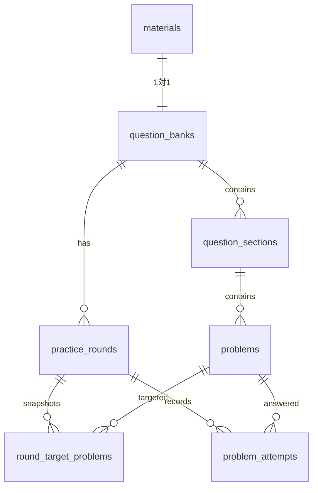

# データベース

## 概要

GoalForgeデスクトップ版はSQLiteを使用します。DBファイル`goalforge.sqlite`は、Tauriが決定するmacOSのApplication Supportディレクトリに保存し、Gitでは管理しません。

Bundle IDを`jp.kenta.goalforge.desktop`へ変更した初回起動時は、新しい保存先にDBがない場合に限り、旧Bundle ID `jp.kenta.goalforge`の`goalforge.sqlite`とWAL関連ファイルを新しい保存先へコピーします。旧DBは自動削除しません。

- 外部キー: 有効
- Journal mode: WAL
- 得点: 1000分の1点単位の整数
- スキーマ履歴: `schema_migrations`
- 旧データ移行履歴: `data_migrations`

## ER図



`question_banks`は既存UI/APIとの互換レイヤーとして残し、ユニークインデックスにより`materials`と1対1に制約しています。

## テーブル一覧

| テーブル | 役割 | 主な関連 |
|---|---|---|
| `schema_migrations` | 適用済みスキーマMigration | バージョンを一意に管理 |
| `app_state` | アプリ状態のJSON保存 | キー単位 |
| `data_migrations` | LocalStorageなどのデータ移行履歴 | 移行キー単位 |
| `materials` | 教材マスター | 目標ID、教材名 |
| `question_banks` | 教材に対応する演習構造の互換レイヤー | `materials`と1対1 |
| `question_sections` | 教材内のセクション | 評価形式、模試区分、並び順 |
| `problems` | 問題マスター | 配点、評価形式、復習状態、補足情報 |
| `practice_rounds` | 教材ごとの演習周回 | 周回番号、開始・完了日時 |
| `round_target_problems` | 周回開始時の対象問題スナップショット | 周回と問題の中間テーブル |
| `problem_attempts` | 問題単位の解答履歴 | 解答順、得点、満点、確信度、メモ、学習日時 |

## データ設計上の原則

- 教材・セクション・問題はマスターとして一意に管理します。
- 周回と履歴はマスターIDを参照し、教材を複製しません。
- 過去の採点結果を保つため、解答時点の満点を`problem_attempts.max_score_milli`へ保存します。
- `problem_attempts.answered_at`は学習日時です。過去履歴などで日時が不明な場合は`NULL`を許可します。
- `problem_attempts.attempt_number`は、そのProblemに対する解答順です。1から始まり、Problemごとに一意です。
- `attempt_number`はAttempt作成時にのみ決定する不変値であり、Attempt編集では変更しません。
- Problem履歴は学習日時ではなく`attempt_number DESC`で取得します。
- 周回対象は`round_target_problems`へ保存し、後の復習状態変更から独立させます。
- 教材を削除すると、`materials`を起点とする外部キー`ON DELETE CASCADE`により、対応する`question_banks`、`question_sections`、`problems`、`problem_attempts`、`practice_rounds`、`round_target_problems`を削除します。
- `problems.review_status`は独立したテーブルではなく`problems`行のカラムです。復習状態は問題行とともに消滅します。
- カスケード削除は対象教材の外部キー関係内に限定され、他の教材のデータには影響しません。

削除関係は次のとおりです。

```text
materials
└─ question_banks
   ├─ question_sections
   │  └─ problems
   │     ├─ problem_attempts
   │     ├─ round_target_problems
   │     └─ review_status（problems行のカラム）
   └─ practice_rounds
      ├─ problem_attempts
      └─ round_target_problems
```

## Migration管理

Migration SQLは`src-tauri/migrations/`へ`NNN_description.sql`形式で追加します。現在は次のMigrationがあります。

1. `001_initial.sql`: 初期テーブル、外部キー、制約、インデックス
2. `002_problem_details_and_confidence.sql`: 問題補足情報と3段階の確信度
3. `003_material_master.sql`: 教材と演習構造の1対1制約
4. `004_attempt_number.sql`: 学習日時のNULL許可とProblem単位の解答順

Migration 004は`problem_attempts`を再作成します。既存AttemptはProblemごとに
`answered_at ASC, id ASC`で並べ、`ROW_NUMBER()`により`attempt_number`を1から採番します。
既存の得点、満点、確信度、メモ、学習日時、Problem・Roundとの関連は保持します。

新しいMigrationを追加するときは、Tauri起動時の適用処理にも同じバージョンを登録します。

### 方針

- 適用済みSQLは変更しません。
- 既存データを保持する前進Migrationを追加します。
- SQLiteで制約変更のためにテーブル再作成が必要な場合は、トランザクション内で新テーブル作成、データ変換、旧テーブル削除、リネーム、インデックス再作成を行います。
- Migration失敗時は途中状態を残さないようにします。
- 外部キー、ユニーク制約、チェック制約、インデックスの再現を確認します。
- 変更後は既存DBからのMigrationと新規DB作成の両方を確認します。

## TODO

- スキーマMigration適用処理を連番リスト化し、追加漏れを検知する
- バックアップJSONのスキーマバージョンと復元互換性を文書化する
- クラウド同期を導入する場合の同期メタデータと競合解決方式を設計する
